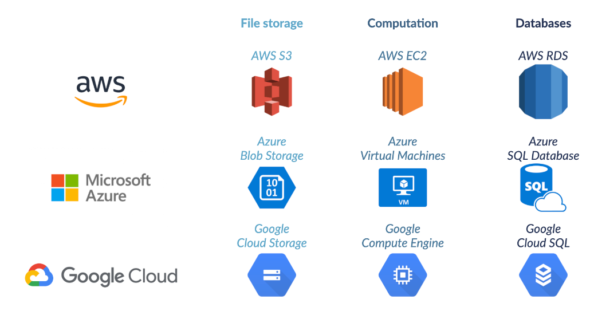

## **Data Processing Value**

- **Objective:** Move and organize data for analysts' ease of access.
- **Data Pipeline Graph:** Illustrates the importance of organized data.
- **Music Files Metadata:** Extraction of metadata (artist name, genre) from music files.
- **Database Storage:** Processed metadata stored for easy access by data analysts and scientists.
- **Schema Alignment:** Aligning data with specific schemas for benefits discussed in previous chapters.
- **Employee Data Example:** Fitting employee data to a specific table schema using logic for distinctions.
- **Productivity Boost:** Automation of data preparation steps at Spotflix for immediate analysis by data scientists.
- **Value Addition:** Insights derived from analyses contribute significant value to the company.

**How Data Engineers Process Data**

- **Responsibilities:** Data engineers handle data manipulation, cleaning, and tidying tasks.
- **Automation:** Automate tasks like rejecting corrupt files and deciding on missing metadata.
- **Structured Database:** Ensure data is stored in a logically structured database.
- **Views Creation:** Create views on top of database tables for easy access by analysts.
- **Optimization:** Optimize database performance, including indexing for efficient data retrieval.

**Tools**
- **Scope Limitation:** The course doesn't cover specific data processing tools.
- **Apache Spark**
  - **Introduction:** Apache Spark is mentioned as a notable tool for data processing.
  - **Further Learning:** Interested learners can find courses on Apache Spark on platforms like DataCamp.
 
## **Scheduling Data**

- **Introduction**
  - Acknowledgment of successful exercises.
  - Transition to the topic of scheduling.

- **Scheduling Overview**
  - Applicability to various data processing tasks.
  - Focus on updating tables and databases for simplicity.
  - Scheduling as the organizational glue in data engineering systems.
  - Coordination of tasks by running them in a specific order and resolving dependencies.

- **Scheduling Methods**
  - Manual execution: Immediate task execution based on requests.
  - Downsides of human dependencies.
  - Preference for automation: Tasks set to execute at specific times or conditions.

- **Examples**
  - Time-based scheduling: Updating the employee database every morning at 6 AM.
  - Sensor scheduling: Executing tasks based on specific conditions.
  - Condition-based scheduling: Updating specific tables only if certain conditions are met.

- **Optimal Scheduling**
  - Balancing optimal options with resource considerations.
  - Manual and automated systems complementing each other.

- **Data Ingestion Methods**
  - Batch processing: Sent in groups at specific intervals; cost-effective.
    - Examples: Songs uploaded, employee table updates, finance department revenue table.
  - Stream processing: Individual data records sent immediately.
    - Examples: User sign-up, online vs. offline listening.

- **Simplified Real-time Processing**
  - Real-time processing mentioned but simplified as equivalent to streaming in this course.

- **Scheduling Tools**
  - Mention of scheduling tools: Apache Airflow, Luigi.

 ## **Parallel Computing**

- **Importance:**
  - Basis of modern data processing tools.
  - Critical for memory and processing power optimization.

- **Big Data Processing:**
  - Tasks are split into smaller subtasks.
  - Subtasks distributed over multiple computers.

**Note:** Parallel computing is essential for efficient data processing, addressing both memory and processing power considerations. In big data processing, tasks are divided into smaller subtasks, which are then distributed across multiple computers.

## Cloud Providers 

