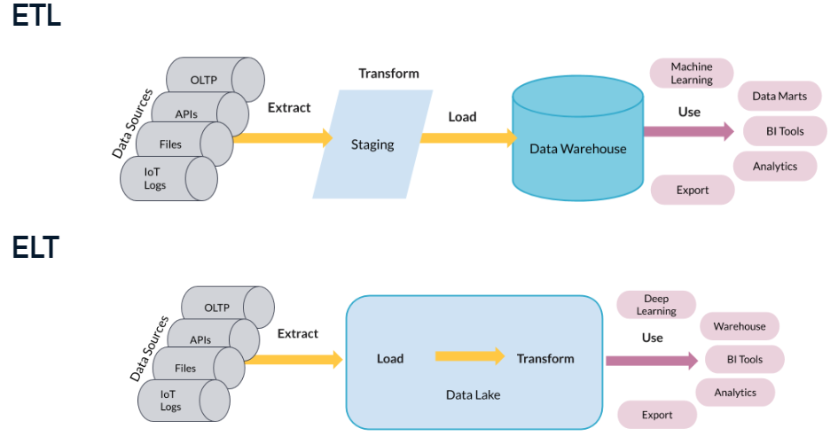

## 1 . Data Processing with OLTP - OLAP

### Organizing and Managing Data
- **Key Question:** How should we organize and manage data efficiently?
- **Considerations:**
  - Different schemas, management options, and objects in a database
  - Various factors impacting data storage and access, including query speed, memory usage, and cost
### Approaches to Data Processing
- **OLTP and OLAP:** These are fundamental approaches to processing data, influencing data flow, structure, and storage.
- **OLTP (Online Transaction Processing):** Oriented around day-to-day transactions.
- **OLAP (Online Analytical Processing):** Oriented around analytics and business decision-making.
- 
| Feature             | OLTP                                     | OLAP                                             |
|---------------------|------------------------------------------|--------------------------------------------------|
| **Purpose**         | Day-to-day transactions                   | Analytics and business decision-making          |
| **Design**          | Application-oriented, daily operations   | Subject-oriented, specific analyses, long-term insights |
| **Data**            | Transaction snapshots for daily operations | Consolidated data for long-term analysis        |
| **Size**            | Typically smaller datasets               | Larger datasets for in-depth analysis           |
| **Query Complexity**| Simpler queries                          | More complex queries for strategic analysis    |
| **Users**           | Broader audience, including customers   | Primarily analysts and data scientists          |

## 2. Store Data
### Structuring Data
- Data can be structured, unstructured, or semi-structured.
- **Structured data**
  - follows defined schemas and is organized, making it easier to analyze but less flexible.
  - _e.g., SQL, tables in a relational database _
- **Unstructured data**
  - raw and lacks a predefined structure, common in media files and raw text.
  - e.g., photos, chat logs, MP3
- **Semi-structured data**
  - has an ad-hoc self-describing structure, offering some organization.
  -   - e.g., NoSQL, XML, JSON
### Beyond Traditional Databases
- **Traditional databases** include operational databases for OLTP and data warehouses for OLAP.
- With the rise of big data, **data lake**s become essential for storing and analyzing vast amounts of varied data.
  #### Data Warehouses
  
- Optimized for read-only analytics, combining data from various sources.
- Utilizes dimensional modeling and a denormalized schema.
- Offered by major cloud providers like Amazon, Google, and Microsoft.
  #### Data Lakes
- Cost-effective storage for massive amounts of unstructured data.
- Cheaper due to object storage and can store petabytes of data.
- Schema-on-read allows flexibility but requires good organization to prevent becoming a "data swamp."
- Used not just for storage but increasingly for analytics tasks like deep learning.
### ETL and ELT

- Extract, Transform, Load (ETL) is a traditional approach, transforming data before storage.
- Extract, Load, Transform (ELT) is common in big data projects, storing data in its native form and transforming it as needed.
- Both approaches involve building data pipelines for various purposes, from data warehousing to deep learning.
