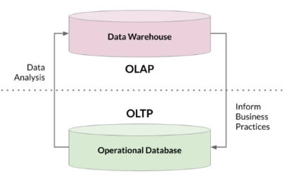

## 1 . Manage Data

### Organizing and Managing Data
- **Key Question:** How should we organize and manage data efficiently?
- **Considerations:**
  - Different schemas, management options, and objects in a database
  - Various factors impacting data storage and access, including query speed, memory usage, and cost
- **No One-Size-Fits-All Answer:** The optimal solution depends on how the data will be used.

| Feature             | OLTP                                     | OLAP                                             |
|---------------------|------------------------------------------|--------------------------------------------------|
| **Purpose**         | Day-to-day transactions                   | Analytics and business decision-making          |
| **Design**          | Application-oriented, daily operations   | Subject-oriented, specific analyses, long-term insights |
| **Data**            | Transaction snapshots for daily operations | Consolidated data for long-term analysis        |
| **Size**            | Typically smaller datasets               | Larger datasets for in-depth analysis           |
| **Query Complexity**| Simpler queries                          | More complex queries for strategic analysis    |
| **Users**           | Broader audience, including customers   | Primarily analysts and data scientists          |

## 2. Store Data
