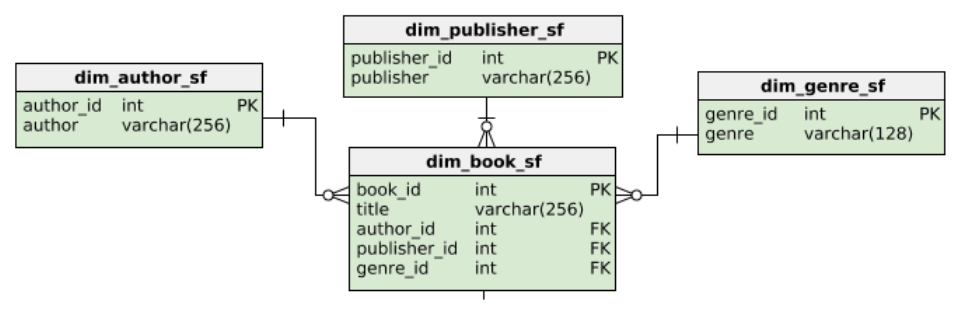

## 1.  Star Schema
- **Overview:** Simplest form of the dimensional model.
- **Components:**
  - Fact Table: Holds metrics records.
  - Dimension Tables: Provide details related to the metrics.
- **Example:** Book sales database for bulk sales across the US and Canada.
- **Connection Pattern:** One-to-many relationships represented by lines, forming a star shape.
  ### **1.1  Star Schema Example**
    - **Fact Table:** Holds sales amount and quantity.
    - **Dimensions:**
      - Books Sold
      - Time of Sale
      - Store Buying the Books
    - **Relationships:** One-to-many, creating the star schema appearance.

  ### **1.2 Snowflake Schema (an Extension)**
    - **Extension of Star Schema:** More tables involved.
    - **Similarities with Star Schema:**
      - Same Fact Table.
      - Information remains the same.
    - **Difference:** Dimension tables are more normalized, extending over multiple dimensions.

## 2.  Normalization
- **Definition:** Technique dividing tables into smaller ones, connected via relationships.
- **Goal:** Reduce redundancy and enhance data integrity.
- **Example:** Identifying repeating groups in the book dimension and normalizing them.
- Example: **Book Dimension**
- **Star Schema:**
  - Represents titles, authors, publishers, and genres.
- **Normalization (Snowflake Schema):**
  - Creates separate tables for authors, publishers, and genres.

- More example: **Time Dimension**
- **Normalization:** Extends days to months, quarters, and more.

## 3. Normalized and Denormalized Databases
  ### 3.1  Reasons to Normalize a Database
  **1. Space Savings**
         - Denormalized databases have data redundancy.
         - Normalization eliminates data redundancy, saving space.
  **2. Data Integrity:**
         - Ensures data consistency and naming conventions.
         - Simplifies modification by reducing duplicates.
         - Easier schema alteration due to smaller, organized tables.
  ### 3.2  Database Normalization
  - **Pros and Cons:**
      - Pros: Improved data integrity, better organization for schema changes.
      - Cons: More complex queries, potential slowdown in indexing and data reading.
  - **Decision Criteria:**
      - Depends on the read- or write-intensiveness of the database.
  ### 3.3  OLTP and OLAP
- **Normalization Preference:**
  - OLTP (Write-Intensive): Favors normalization for quick and consistent data additions.
  - OLAP (Read-Intensive): Prioritizes quicker read queries, avoiding complex joins.
